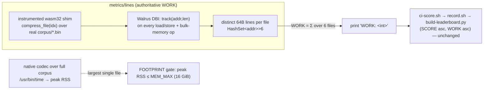

# RFC 0001 — Account for complexity and memory, not just bytes

**Status:** Draft / request-for-comment.
**Scope:** how submissions are judged — the `metrics/` meters,
`measure-complexity.sh`, `ci-score.sh`, `record.sh`, `build-leaderboard.py`,
`verify.yml`, `AUTORESEARCH.md`, and a new `MEM_MAX` validity gate. Touches
frozen paths on purpose: this is an infra/policy proposal, **not** a competition
entry, so it intentionally fails the `src/algorithm/`-only boundary guard. No
`src/algorithm/` change.

## TL;DR

1. **WORK-as-tiebreaker has no optimization gradient** — it bites only on an
   *exact* byte tie, so bots ignore complexity. The current record spends
   ~3.5 GB freely; WORK never affected its ranking (§2).
2. **Don't fold WORK into SCORE** with a product or weighted sum (`b·g`, `b+λg`):
   bytes are a *quality* target, cost is a *cost*; combining needs an arbitrary,
   gameable exchange rate (§3).
3. **Instead make WORK price real cost, and rank `(SCORE asc, WORK asc)`.** The
   cost that dominates wall-clock is **memory traffic** — random scatter across
   multi-GB tables — which operator-fuel is blind to (a cache miss and an L1 hit
   are the same one operator). So **WORK = distinct 64-byte cache lines touched**,
   not fuel + allocation (§4). Measured: a 64× larger table moves traffic 4.1×
   but fuel +0.07 % (§4.1); the allocation term is inert at ~0.002 % (§4.2).
4. **Meter the full SCORE corpus, not an 8 KB prefix** — the prefix is gameable
   (`compress()` can branch on `input.len()`) and runs a different table regime.
   This fits in **wasm32, no wasm64**: one 384 KB file at the 2²² regime peaks at
   a measured **3.48 GiB**, under the 4 GiB ceiling (§4.3).
5. **Drop `HEAP_GAS_PER_BYTE`** (inert). **Add a `MEM_MAX` footprint gate set to
   the verifier's RAM — `MEM_MAX = 16 GiB`** — measured as native peak RSS; its
   only job is "won't OOM the judge" (§4.5).
6. The integer `WORK:` contract is preserved, so `ci-score.sh`, `record.sh`, and
   `build-leaderboard.py` need **zero** changes.

## 1. The problem

SCORE (compressed bytes) is optimized well, but nothing constrains resources, so
the frontier drifted to correct-but-degenerate solutions: the current record
peaks at multiple GB of reserved memory (and tens of minutes) to compress a
2.36 MB corpus. A valid SCORE winner; a poor codec.

## 2. Why the current WORK tiebreaker doesn't change behavior

Ranking is `(SCORE asc, WORK asc)` with WORK breaking *exact* byte ties only.
Independent algorithm changes essentially never tie to the byte, so WORK has no
gradient and a rational optimizer spends it freely. (Its one active effect is to
reward output-neutral micro-optimization of an existing record — real but narrow.)

## 3. Why a combined SCORE formula is the wrong tool

`b·g` treats bytes and cost symmetrically (a 1 % cost cut "buys" a 1 % byte cut),
contradicting "bytes primary," and its optimum sits at a mediocre middle. `b+λg`
needs an arbitrary λ that bots park on and that you tune forever. The ECDSA `t·q`
analogy doesn't transfer: there both factors are pure costs; here one is the goal.
The fix is not to combine bytes and cost, but to make the *cost* axis (WORK)
actually measure cost, and keep the two-key sort.

## 4. The fix: WORK = memory traffic

### 4.1 Why fuel can't see the cost — measured

Two builds of the codec, identical 8 KB input, identical operator count, only the
small-input context-table size changed:

| context tables | distinct 64B lines touched | bytes touched | WORK (init-free fuel) |
|---|---:|---:|---:|
| 2¹⁶ slots | 10,390,194 | 664,972,416 | 8,249,510,050 |
| 2²² slots | 42,968,754 | 2,750,000,256 | 8,255,239,687 |

(WORK measured before the heap term was dropped; the ≤173 KB heap component is
within rounding, so the +0.07 % conclusion is unchanged for fuel-only WORK.)

A **64× larger table → 4.1× more memory traffic, but WORK moves +0.07 %.** Fuel
is flat because the operator stream is unchanged; only the *addresses* moved,
scattering across 2.75 GB of distinct lines instead of 665 MB. Wall-clock tracks
the traffic, not the fuel. A metric meant to price real cost must price the
traffic — exactly what distinct-lines-touched does, and what fuel and allocation
both miss.

### 4.2 Why an allocation term is inert — measured

An earlier draft of this RFC folded heap allocation into WORK. Measured on the
8 KB prefix, differenced (full − half) to cancel one-time setup:

```
full 8192B  heap 1,173,403,332 B
half 4096B  heap 1,173,229,764 B
WORK heap contribution (differenced) = 173,568 B  ≈ 0.002 % of 8.23e9 WORK
```

The multi-GB tables are allocated once at `Cm::new` and cancel in the differenced
WORK; the codec is allocation-free in steady state (228 mallocs total).
`HEAP_GAS_PER_BYTE` prices essentially nothing. **This PR drops it** — WORK is
init-free wasm fuel, and heap churn is reported as a separate non-ranking
diagnostic line, not folded in as "WORK now prices memory" (it does not).

### 4.3 Full-corpus metering fits in wasm32 — measured

The objection to full-corpus metering was the wasm32 4 GiB ceiling. It does not
bind. Measured directly (instrumented shim compressing a real 384 KB corpus file
at the live 2²² regime, reading `memory_size(0)`):

```
peak linear memory: 56984 pages = 3,734,503,424 bytes = 3.48 GiB   (< 4 GiB)
```

Composition (assoc tables dominate): 101 of the 106 contexts use 8-way
set-associative tables (`model.rs:358-365`; only contexts 0,1,2,8,93 stay small),
each `2²² × sizeof(Slot)`. **`Slot` is 5 bytes** (`#[repr(C, packed)]`,
`{i16, u8, u8, u8}`, align 1 — `model.rs:55`, packed so an 8-way bucket fits one
64 B line), so 101 × 2²² × 5 B = **1.97 GiB** of assoc tables; the remaining
~1.5 GiB is CTW's 2²⁴-node arena, the two DMCs, StateMaps, and buffers.

Two consequences:
- **wasm64 is not needed**, so the design stays on the pinned **stable** 1.93.1
  toolchain. `wasm64-unknown-unknown` needs nightly + `-Zbuild-std`, which would
  reopen the cross-machine codegen variance the pin exists to close.
- **The 4 GiB ceiling self-enforces WORK-metering.** Headroom is thin
  (3.48 / 4.0 ≈ 87 %). The next table doubling (2²²→2²³) roughly doubles assoc
  storage to ~3.9 GiB (total well over 4 GiB) and **traps on `memory.grow`**, so the wasm32 meter cannot
  produce a WORK number for it — such a codec becomes unrankable (sorts +∞) even
  though the separate 16 GiB OOM gate (§4.5) would let it run natively. This is
  the rank/gate seam (§4.5).

### 4.4 The design



*Target design.* The `metrics/lines` meter **landed in this PR is a prototype** —
it instruments scalar load/store over an 8 KB prefix. Full-corpus `compress_file`,
the bulk-memory instrumentation, promotion to the authoritative WORK, and the RSS
footprint gate are **proposed** here (§7–§8), not yet wired (§9).

**WORK** (target) = Σ over the 6 real corpus files of `distinct_64B_lines(file)`, each file
compressed *in full* in a *fresh* wasm instance (matching the scorer — `mod.rs:33`
builds a new model per `compress`). Ranking stays `(SCORE asc, WORK asc)`; WORK is
now a real gradient, not just an exact-byte tiebreaker.

**Why distinct-lines and not a cache simulator.** A fixed L1/L2/LLC LRU model is
the wrong tool here: against a ~3.5 GiB working set, any realistic LLC misses
~100 %, so modeled DRAM traffic collapses to a near-constant multiple of access
count — no gradient over fuel. Worse, a public set-associative geometry is a
frozen target: a submission can permute table bases to collide into fewer modeled
sets with no real-hardware benefit ("optimize the simulator, not the silicon").
**Distinct-lines is associativity-free** — the only way to lower it is to
genuinely touch fewer 64 B lines (smaller tables, better packing, fewer models,
blocking), the real working-set reduction that tracks wall-clock. `LINE = 64`
matches the codec's deliberate 8-way × 5 B bucket packing.

### 4.5 Gates, ranking, and MEM_MAX

| | what | basis | role |
|---|---|---|---|
| GATE 1 | losslessness | `decompress(compress(x)) == x` | validity (existing) |
| GATE 2 | FOOTPRINT ≤ `MEM_MAX` | **native peak RSS** on the verifier, largest single file | validity (new) |
| RANK | `(SCORE asc, WORK asc)` | WORK = Σ distinct-lines (wasm32) | order among valid entries |

**`MEM_MAX = 16 GiB = 17,179,869,184 bytes`** — the physical RAM of the CI
verifier (GitHub-hosted `ubuntu-latest`). The footprint gate exists for exactly
one reason: a submission must not OOM-kill the judge. So it is pinned to the
judge's actual memory, not a hand-picked budget. A submission is **valid** iff its
peak resident set on the largest single corpus file stays under the machine that
scores it; anything heavier already dies as a verifier OOM (the `exit 143` seen
historically) — the gate just converts that cryptic failure into an explicit
`INVALID: footprint X > MEM_MAX` verdict.

**Basis = native peak RSS, not the wasm high-water.** A 16 GiB ceiling is
unreachable by the wasm32 meter (hard-capped at 4 GiB), which would make a
wasm-based gate vacuous. So GATE 2 measures the *native* codec's peak RSS over the
whole corpus (e.g. `/usr/bin/time` "maximum resident set size"). RSS is:
- **source-agnostic** — counts heap + `static`/BSS + stack + arena, so a
  static-table bypass (a `static mut [u8; N]` that the heap-only `metrics/mem`
  meter reports as ~0) cannot dodge it;
- **OOM-faithful** — it is literally the quantity the OS OOM-killer watches;
- **non-deterministic** — but determinism only matters for a *ranking* input
  (WORK). For a pass/fail OOM gate with a ~12 GiB margin between the current
  ~3.5 GiB frontier and the 16 GiB cliff, ±a few hundred MB of RSS jitter is
  irrelevant. Never rank on RSS; gating on it is fine.

`metrics/mem` (native, deterministic, heap-only) is an **informational diagnostic
only** — heap-blind, so it must never gate or rank. `HEAP_GAS_PER_BYTE` and the
heap term **are dropped from WORK** in this PR (§4.2); the wasm fuel meter
(`metrics/host`) **remains today's ranking WORK**, and the proposal (§4.4) would
promote the touched-lines meter to authoritative WORK and reduce the fuel meter to
a local advisory.

> **Headroom note.** A process cannot safely use 100 % of physical RAM (OS, page
> cache, the Rust toolchain, and `wasmtime` all coexist on the runner). `MEM_MAX =
> 16 GiB` is the literal machine RAM; in practice consider enforcing at ~14 GiB to
> leave headroom. Maintainer call — pin the chosen value in `AUTORESEARCH.md`.

**The rank/gate seam (must document).** The WORK meter runs in wasm32 and can only
*rank* submissions whose per-file footprint is ≤ 4 GiB (above that it traps on
`memory.grow` and produces no WORK). The OOM gate allows up to 16 GiB. So a
submission between 4 and 16 GiB is **valid (won't OOM the judge) but unrankable by
the wasm32 WORK meter** — with no WORK it sorts as +∞ (`build-leaderboard.py`) and
cannot win a tie, though it can still win outright on SCORE. Ranking the full
16 GiB range on memory traffic would require wasm64 WORK metering, which reopens
the codegen variance the toolchain pin closes (§4.3) — deferred. Today's frontier
(3.48 GiB) sits comfortably inside the wasm32-rankable band, so the seam is latent.

## 5. Anti-gaming — each hole and its closure

| hole | status | closed by |
|---|---|---|
| `len()`-branch on a meter-only prefix | **closed** | meter compresses each real 393,216 B file in full — no distinguished meter length |
| prefix is a different table regime | **closed** | every metered file ≥ 262,144 B, so the meter runs the same 2²² regime SCORE runs (`model.rs:373,378`) |
| `static`-table footprint bypass | **closed** | WORK (touched lines) and the gate (native RSS) are both source-agnostic |
| **bulk-memory evasion** (real) | **must ship** | extend the Walrus pass to instrument `memory.fill`/`copy`/`init` + V128, tracking the runtime `[dest, dest+len)` (and `[src, …)` for copy). Without it, traffic routed through `copy_from_slice` / slice-fill (`mod.rs:54`, `model.rs` zero-fills) vanishes from WORK while wall-clock is unchanged. **Mandatory.** |
| meter tampering | n/a | all of `metrics/*` is outside `src/algorithm/` (`guard.sh` boundary); `guard.sh` also rejects a `#[global_allocator]` in `src/algorithm/` |
| missing WORK to dodge ranking | closed | `ci-score.sh` aborts on unparseable WORK; `build-leaderboard.py` sorts missing WORK as +∞ |

Accepted residual: an entry that genuinely touches fewer lines for the same bytes
wins on WORK. That is the intended efficiency gradient, not an exploit.

## 6. Determinism

Distinct-line count is a pure function of the emitted wasm bytecode over fixed
corpus bytes — independent of host CPU/OS/page-size/RSS. Guarantees:

- Built for the pinned `wasm32-unknown-unknown`, channel 1.93.1
  (`rust-toolchain.toml`). wasm64 is **not** used (§4.3).
- Pin `wasmtime` to an exact `=26.x.y` in `metrics/lines/Cargo.toml` (today's
  caret `26` is latent variance); commit `Cargo.lock`; build `--locked`.
- The `track()` set is keyed by `u64` line index and only `.len()` is read —
  `HashSet` iteration order is irrelevant.
- `target-cpu=native` lives at `[build]` workspace scope in `.cargo/config`; every
  meter build must scrub `RUSTFLAGS=""`. The determinism rests on this one scrub —
  add a CI assertion that the metered wasm bytes hash-match across the matrix, and
  consider moving `target-cpu=native` into a profile that cannot reach `metrics/`.
- CI invariant: meter twice on the same SHA, assert the per-file 6-tuple is
  byte-identical. Never rank on native RSS or wall-clock.

## 7. File changes

*Proposed* changes to wire the target design (distinct-lines WORK + RSS gate).
Most are **not landed in this PR** — see §9 for what ships here versus what this
list proposes.

- `metrics/wasm/src/lib.rs` — `include_bytes!` all 6 `corpus/*.bin`; add
  `compress_file(idx: u32) -> u32` that compresses the full file (no prefix/length
  knob); keep `cm_mem_pages`; drop the `Tracking` allocator + `cm_heap_bytes`.
- `metrics/lines/src/main.rs` — (a) add instrumentation arms for
  `MemoryFill`/`MemoryCopy`/`MemoryInit` + V128, tracking runtime length operands;
  (b) loop `idx 0..6` with a fresh instance per file, accumulate per-file
  `set.len()` into a `u64`, print `WORK: <total>`; (c) keep the double-run
  determinism assert over the 6-tuple; (d) pin exact `wasmtime`.
- `metrics/lines/Cargo.toml` — pin `wasmtime = "=26.x.y"`; commit `Cargo.lock`.
- `scripts/measure-complexity.sh` — build the wasm32 corpus shim + promoted lines
  meter `--locked` with `RUSTFLAGS=""`; emit the summed `WORK:`; retire the fuel
  host call from the ranking path (local advisory only).
- `scripts/measure-memory.sh` — relabel the deterministic heap `MEM` as
  diagnostic/non-gating; add the gating **FOOTPRINT** line = native peak RSS over
  the corpus (`/usr/bin/time -v` "Maximum resident set size" on the Linux verifier;
  largest single file).
- `scripts/evaluate.sh` (verify path) — parse FOOTPRINT (peak RSS), fail
  `INVALID: footprint X > MEM_MAX` if `> MEM_MAX` (16 GiB = 17,179,869,184 B);
  enforce only after the observe phase.
- `metrics/host/src/main.rs` — drop `HEAP_GAS_PER_BYTE` + heap term (demoted to
  local advisory).
- `AUTORESEARCH.md` — redefine WORK as Σ distinct-64B-lines over the full corpus;
  document `MEM_MAX = 16 GiB` (verifier RAM) gated on native peak RSS, plus the
  rank/gate seam and the wasm32 WORK-metering ceiling; record the **metric-epoch
  boundary** (new WORK numbers are incomparable to old fuel WORK); add "smaller
  working set / better locality" as the primary WORK-reduction lever.
- `.github/workflows/verify.yml` — build wasm32, run the meter twice, assert the
  identical per-file tuple; FOOTPRINT `continue-on-error` during observe, gating at
  enforce.
- `ci-score.sh` / `record.sh` / `build-leaderboard.py` — **no change** (integer
  `WORK:` contract and `(SCORE asc, WORK asc)` sort preserved).

## 8. Migration

1. **Report-only.** Promote `metrics/lines` to wasm32 full-corpus per-file metering
   (with bulk-memory instrumentation); print the new summed WORK and the FOOTPRINT
   line alongside the old fuel WORK. No ranking change. Mark the metric-epoch
   boundary in `AUTORESEARCH.md`.
2. **Validate.** Add the CI double-run tuple assert and cross-matrix wasm-bytes
   hash check. Hard-gate that the wasm32 meter's `compress` output equals the
   native scorer on all 6 files (catches any `usize` / `(1<<27)-1` clamp divergence
   at `mod.rs:33`) before trusting WORK. Verify `memory.fill`/`copy` instrumentation
   by diffing WORK with/without a deliberate `copy_from_slice` in a throwaway branch.
3. **Switch ranking** to the new summed-lines WORK. No plumbing edit (integer
   contract unchanged). Old fuel-WORK entries are frozen as a prior epoch.
4. **Flip the gate.** Observe per-file native peak RSS across entries (frontier
   ~3.5–4.4 GiB), then enforce `MEM_MAX = 16 GiB` in `evaluate.sh`/verify. Pin the
   value + headroom decision in `AUTORESEARCH.md`.

Rollback: each phase is independent; if bulk-memory instrumentation or the
byte-equality gate fails, stay on report-only (old fuel WORK keeps ranking) — no
entry is ever recorded WORK-free (`ci-score.sh` aborts on unparseable WORK).

## 9. Status of the meters in this PR

- **Landed (report-only, non-gating):** WORK = init-free wasm fuel, with heap
  churn and peak linear memory as separate diagnostic lines (`HEAP_GAS_PER_BYTE`
  and the heap term removed from the ranking number); the reusable tracking
  allocator (`metrics/telemetry`); the native full-scale heap meter (`metrics/mem`
  → diagnostic); the touched-lines prototype (`metrics/lines`, 8 KB-prefix
  scalar load/store); `rust-toolchain.toml`; and the `verify.yml` complexity step.
- **Hardened by independent multi-agent review:** `guard.sh`/`guard-pr.sh` reject a
  `#[global_allocator]` in `src/algorithm/`; `ci-score.sh` aborts rather than
  recording a WORK-free entry; the heap-only limitation of `MEM` is documented; the
  fuel subtraction is fail-loud.
- **Not yet wired (this PR adds no gate):** the distinct-lines WORK redefinition,
  the bulk-memory instrumentation, and the `MEM_MAX` footprint gate are the
  maintainer-facing proposal above — steps 1–4 of §8.

## 10. Open items (need a tool the dev box lacks, or a maintainer call)

- **Bulk-memory instrumentation correctness.** A raw byte-scan finds 0xFC
  (bulk-memory) and 0xFD (SIMD) opcodes in the meter wasm, but that is not
  opcode-aligned. Confirm the actual `memory.fill`/`copy` emission for `vec![0; N]`
  with `wasm-tools`/`wasm-objdump` (not installed here) and validate the Walrus
  length-operand tracking against a known-traffic microbenchmark before trusting
  WORK.
- **Per-file meter runtime.** A host-call per memory op on a full 384 KB file at
  2²² may run many minutes. Measure a wall budget and add a `WORK_MAX`/timeout
  backstop so a pathological entry can't hang CI. The 6 files are independent —
  parallelize across CI cores.
- **Sum vs union of per-file line sets.** Chosen: **sum** (each file uses a fresh
  model, so its zero-fill traffic is real per-file cost). Confirm the semantics and
  document.
- **MEM_MAX headroom.** Enforce at the literal 16 GiB or back off to ~14 GiB for
  runner headroom (§4.5).

## Appendix — verification artifacts

- §4.1 table: `docs/proposals/0001-lines-evidence.txt` (two-build LINES vs WORK).
- §4.3 figure: instrumented full-corpus shim, `peak linear memory: 56984 pages`.
- §4.2 figures: `measure-complexity.sh` heap full/half.
